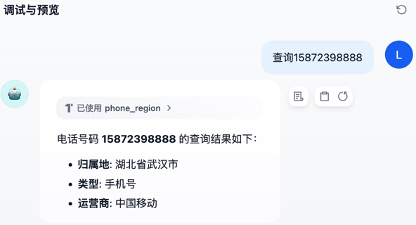

## dify-plugin-phone

- **Author:** [rainlzm](https://github.com/rainlzm)
- **Github:** https://github.com/rainlzm/dify-plugin-phone
- **Version:** 0.0.1
- **Type:** tool

### Description
- Query the location and operator of the phone number
- Identify phone number from text
- Simple plugin, simple use

### Usage

- Query the location and operator [General]

- Query the location and operator  [Missed]

- Other Query Example:

